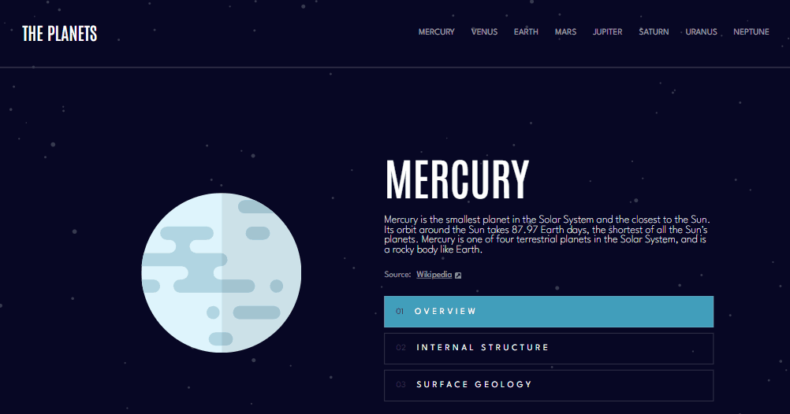
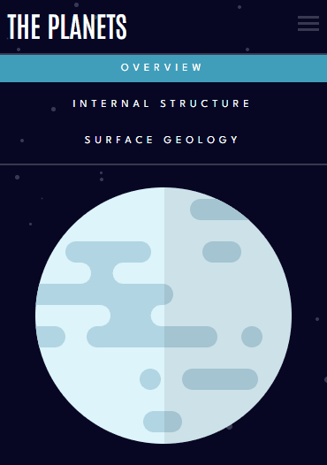
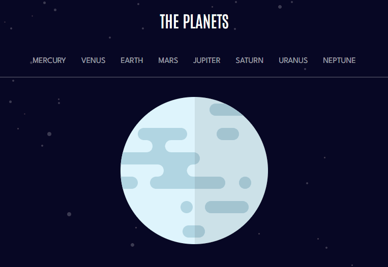

# Desafio Site sobre Fatos dos Planetas - Frontend-Mentor

Este é um desafio de um site astronômico sobre planetas, proposto pelo site Frontend-Mentor.

## Tabela de Conteúdos

- [Visão Geral](#visão-geral)
    - [Imagens](#imagens)
    - [Link da página](#link)
- [Processo](#processo)
    - [Linguagens utilizadas](#linguagens-utilizadas)
    - [O que aprendi](#o-que-aprendi)
    - [Possíveis evoluções](#possíveis-evoluções)
- [Autor](#autor)

## Visão-geral

### Imagens

<br>

````
Versão de Desktop
````

   

<br>

````
Versão Mobile

````

 

<br>

````
Versão Tablet

````

 

### Link

- Página no GitHub Pages: <a href="https://julio-mansan2.github.io/planets-fact-site/">Clique aqui!</a>

## Processo

### Linguagens utilizadas

<br>

- Marcações semânticas de HTML5
- Propriedades de customização do CSS3
- Estruturas de JavaScript

<br>

### O que aprendi

<br>

- Utilizar a função map para trabalhar com arrays:

````javascript

const planetButtons = planetNames.map((name) =>
    document.querySelectorAll(`.btn-${name}`)
);

````

- Trabalhar com matrizes dentro do JavaScript:

````javascript

planetButtons[index].forEach((btn, i) =>
    btn.style.background = i === buttonIndex ? buttonColors[name] : 'none'
);

const buttonColors = {
    mercury: 'var(--blue-pale)',
    venus: 'var(--yellow)',
    earth: 'var(--purple)',
    mars: 'var(--orange-dark)',
    jupiter: 'var(--tomato)',
    saturn: 'var(--orange-strong)',
    neptune: 'var(--blue-strong)',
    uranus: 'var(--aqua)',
};

````
<br>

### Possíveis evoluções

<br>

- Códigos mais compactos;

<br>

## Autor

GitHub - <a href="https://github.com/julio-mansan2">julio-mansan2</a> <br>
Front-end Mentor - <a href="https://www.frontendmentor.io/profile/julio-mansan2">julio-mansan2</a> <br>
LinkedIn - <a href="https://www.linkedin.com/in/j%C3%BAlio-a-mansan-3415a7249/">Júlio A.</a> <br>